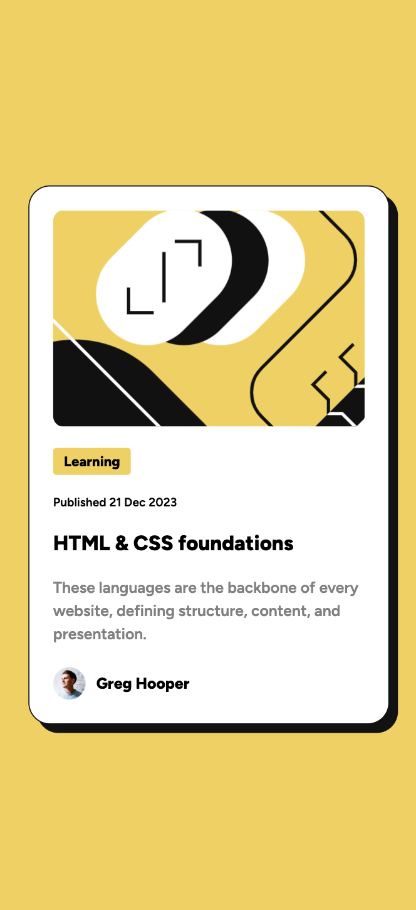
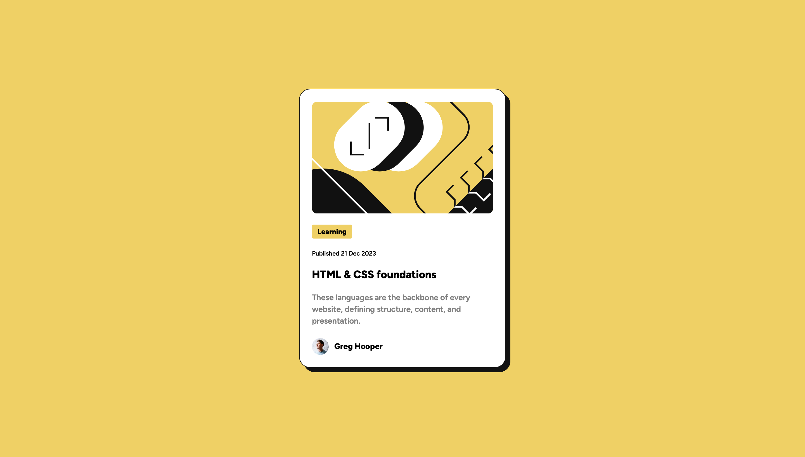

# Frontend Mentor - Blog preview card solution 

## Table of contents

- [Frontend Mentor - Blog preview card solution](#frontend-mentor---blog-preview-card-solution)
  - [Table of contents](#table-of-contents)
  - [Overview](#overview)
    - [The challenge](#the-challenge)
    - [Screenshot](#screenshot)
    - [Links](#links)
  - [My process](#my-process)
    - [Built with](#built-with)
    - [What I learned](#what-i-learned)
    - [Continued development](#continued-development)
  - [Author](#author)
  - [Acknowledgments](#acknowledgments)

## Overview

### The challenge

Users should be able to:

- See hover and focus states for all interactive elements on the page
- See the different size of card on mobile compared to desktop

### Screenshot

<strong>Mobile View</strong>

<strong>Desktop View</strong>

<strong>Active State</strong>

### Links

- Solution URL: [Blog Preview Card by HTML and CSS](https://www.frontendmentor.io/solutions/blog-preview-card-by-html-and-css-caxPPaVJ1a)
- Live Site URL: [Frontend Mentor | Blog preview card](https://vangmanawkairung.github.io/Frontend-Mentor_blog-preview-card/)

## My process

### Built with

- HTML5
- CSS
- Sass
- Flexbox

### What I learned

I've learned how to declare the variables in Sass.

### Continued development

Since the design is the card, so it is possible to make this card filping to see the back of the card.

## Author
- Frontend Mentor - [@VangmanawKairung](https://www.frontendmentor.io/profile/VangmanawKairung)
- GitHub - [Kairung Vangmanaw](https://github.com/VangmanawKairung)

## Acknowledgments

I have to appreciate Frontend Mentor team for spending the time to create this challenge.
